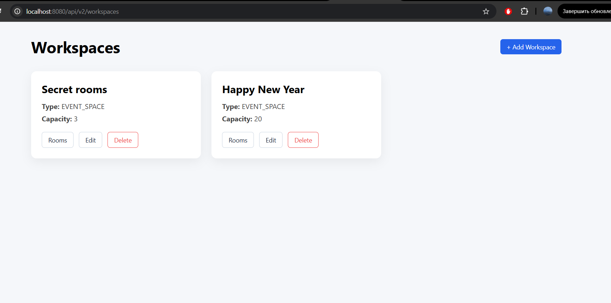
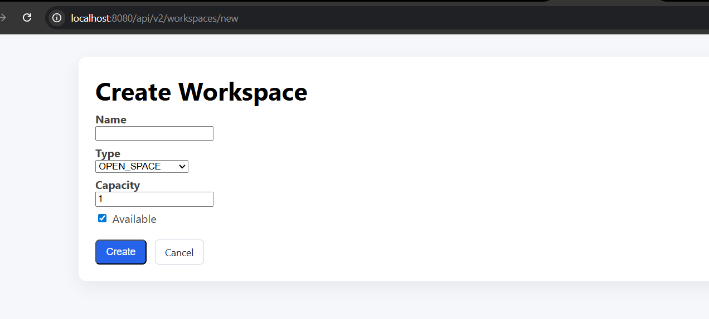
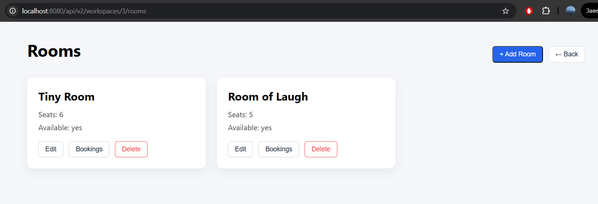
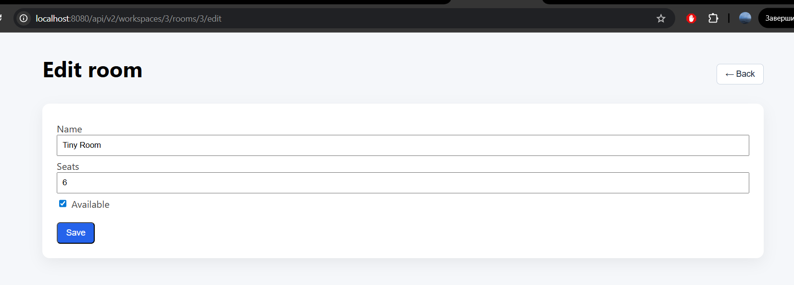
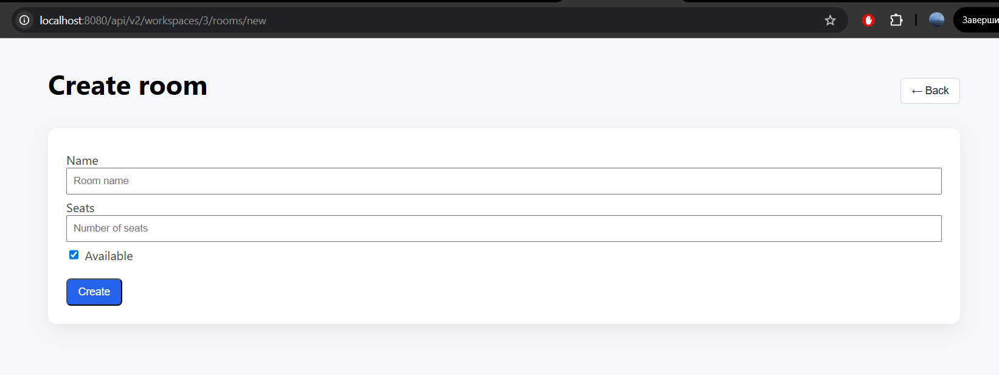
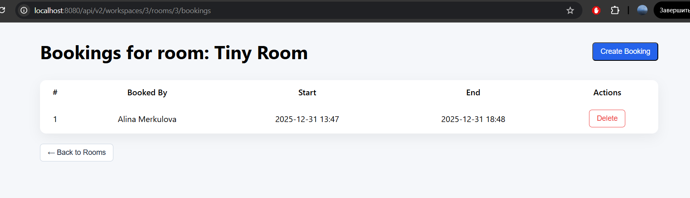
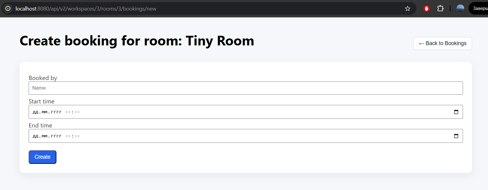

# Практическое задание №3

**Coworking Booking System** - веб-приложение для управления рабочими пространствами, комнатами и бронированиями.
Система позволяет:

- создавать и редактировать коворкинги (workspaces),
- управлять комнатами внутри коворкингов,
- бронировать комнаты на определённые временные интервалы,
- проверять пересечения бронирований и корректность данных.

Приложение построено по принципу REST API + XSLT UI. Есть поддержка представления данных в форматах JSON и XML, 
отображение XML-ответов в браузере с использованием XSLT без серверного рендеринга HTML.

### Используемый стек

**Backend**

- Java 21
- Spring Boot 4
- Spring REST (Spring Web)
- Spring Data JPA
- Jackson (JSON + XML)
- Liquibase
- Lombok

**DBMS**
- PostgreSQL

**Frontend**

- XML
- XSLT
- CSS
- JavaScript (fetch API)

#### Информацию о сущностях и устройстве бизнес-слоёв можно посмотреть в [README лабораторной №2](https://github.com/kate-unmatched/aks_lab_2)

---

## Задание 1. Сравнение JAX-RS (Java EE / Jakarta EE) и Spring REST

Перед началом разработки приложения рассматривались два возможных технологических стека:
- использование **Java EE / Jakarta EE** с JAX-RS для реализации RESTful веб-сервисов;
- использование **Spring Framework** (Spring REST) в составе Spring Boot.

Ниже приведено обобщённое сравнение данных подходов.

### JAX-RS (Java EE / Jakarta EE)

**JAX-RS** - стандарт спецификации Jakarta EE для создания RESTful веб-сервисов.

**Преимущества:**
- является официальным стандартом Jakarta EE;
- обеспечивает переносимость приложений между различными реализациями (Jersey, RESTEasy и др.);
- хорошо подходит для enterprise-приложений в среде полнофункциональных серверов приложений (GlassFish, WildFly);
- чётко формализованный API и жизненный цикл компонентов.

**Недостатки:**
- более высокая сложность настройки и развёртывания по сравнению с Spring Boot;
- необходимость ручной конфигурации многих аспектов (сериализация, фильтры, интерцепторы);
- меньшая гибкость при быстром прототипировании;
- более медленный цикл разработки и внесения изменений.

### Spring REST (Spring Framework)

**Spring REST** - REST-подход, реализованный в рамках экосистемы Spring Framework.

**Преимущества:**
- высокая скорость разработки за счёт автоконфигурации Spring Boot;
- единая экосистема для работы с REST, DI, транзакциями и доступом к данным;
- гибкая и расширяемая архитектура;
- широкое распространение в индустрии и большое сообщество;
- удобная интеграция с инструментами сериализации, тестирования и мониторинга.

**Недостатки:**
- не является частью формального стандарта Jakarta EE;
- сильная привязка приложения к экосистеме Spring;
- избыточность для простых или строго стандартизированных решений.

### Обоснование выбора

При выборе технологического стека приоритетом являлись:
- скорость разработки;
- гибкость архитектуры;
- удобство расширения и сопровождения приложения.

В связи с этим был выбран **Spring REST**, так как он позволяет быстрее реализовать RESTful веб-сервис, 
снизить объём конфигурационного кода и упростить интеграцию различных компонентов системы.

Выбор Spring REST является обоснованным с точки зрения современных практик разработки и соответствует целям проекта.

## Задание 2. Выбор приложения и проектирование REST API

Для разработки было выбрано приложение Coworking Booking System из ЛР №2.

REST API спроектирован в соответствии с принципами REST и использует иерархию вложенных ресурсов:

Все REST-эндпоинты поддерживают форматы **JSON** и **XML**.

### REST API: Workspaces

| HTTP метод | URI                           | Описание                                 | Форматы |
|-----------:|--------------------------------|-------------------------------------------|---------|
| GET        | `/api/v2/workspaces`           | Получение списка рабочих пространств      | JSON / XML |
| GET        | `/api/v2/workspaces/new`       | Форма создания workspace (XML + XSL)      | XML |
| GET        | `/api/v2/workspaces/{id}/edit` | Форма редактирования workspace (XML + XSL)| XML |
| POST       | `/api/v2/workspaces`           | Создание нового workspace                 | JSON / XML |
| PUT        | `/api/v2/workspaces/{id}`      | Обновление workspace                      | JSON / XML |
| DELETE     | `/api/v2/workspaces/{id}`      | Удаление workspace                        | — |

---

### REST API: Rooms

Комнаты являются вложенным ресурсом рабочего пространства.

| HTTP метод | URI                                                        | Описание                                   | Форматы |
|-----------:|-------------------------------------------------------------|---------------------------------------------|---------|
| GET        | `/api/v2/workspaces/{workspaceId}/rooms`                    | Список комнат рабочего пространства         | JSON / XML |
| GET        | `/api/v2/workspaces/{workspaceId}/rooms/new`                | Форма создания комнаты (XML + XSL)          | XML |
| GET        | `/api/v2/workspaces/{workspaceId}/rooms/{roomId}/edit`      | Форма редактирования комнаты (XML + XSL)    | XML |
| POST       | `/api/v2/workspaces/{workspaceId}/rooms`                    | Создание комнаты                            | JSON / XML |
| PUT        | `/api/v2/workspaces/{workspaceId}/rooms/{roomId}`           | Обновление комнаты                          | JSON / XML |
| DELETE     | `/api/v2/workspaces/{workspaceId}/rooms/{roomId}`           | Удаление комнаты                            | — |

---

### REST API: Bookings

Бронирования являются вложенным ресурсом комнаты.

| HTTP метод | URI                                                                 | Описание                                   | Форматы |
|-----------:|----------------------------------------------------------------------|---------------------------------------------|---------|
| GET        | `/api/v2/workspaces/{workspaceId}/rooms/{roomId}/bookings`           | Список бронирований комнаты                 | JSON / XML |
| GET        | `/api/v2/workspaces/{workspaceId}/rooms/{roomId}/bookings/new`       | Форма создания бронирования (XML + XSL)    | XML |
| POST       | `/api/v2/workspaces/{workspaceId}/rooms/{roomId}/bookings`           | Создание бронирования                      | JSON / XML |
| DELETE     | `/api/v2/workspaces/{workspaceId}/rooms/{roomId}/bookings/{bookingId}` | Удаление бронирования                      | — |

**Особенности проектирования REST API**
- используются вложенные ресурсы для отражения предметной области;
- операции создания, обновления и удаления выполняются через REST API;
- сервер не содержит логики обработки HTML-форм;
- пользовательский интерфейс формируется на стороне клиента с использованием XSLT.

## Задание 3. Реализация REST API с поддержкой XML и JSON

REST API приложения поддерживает форматы JSON и XML для входных и выходных данных.  
Поддержка форматов реализована дифференцированно в зависимости от назначения эндпоинта.

- **Эндпоинты бизнес-логики** (создание, обновление, удаление сущностей) принимают и возвращают данные в форматах `application/json` и `application/xml`.
- **UI-эндпоинты** (отображение списков и форм) возвращают данные только в формате **XML**, который используется для XSL-преобразований в браузере.

Для сериализации используется библиотека **Jackson** с поддержкой XML (`XmlMapper`).  
DTO-классы аннотированы с помощью `@JacksonXmlRootElement` и wrapper-DTO применяются для списков сущностей.

Для XML-ответов REST API автоматически добавляется `xml-stylesheet` processing instruction.

## Задание 4. XSL-преобразования для отображения XML в браузере

Для отображения XML-ответов REST API в браузере используются **XSL-преобразования (XSLT)**.  
XSL-файлы размещены в статической части веб-слоя приложения и применяются на стороне клиента.

XSLT используется для:
- преобразования XML-данных в HTML;
- отображения списков сущностей и форм;
- реализации навигации между связанными сущностями.

Для каждой группы ресурсов разработаны отдельные XSL-файлы:
- список рабочих пространств и формы создания/редактирования;
- список комнат и формы создания/редактирования;
- список бронирований и форма создания бронирования.

Навигация между страницами реализована через REST-URI и XSLT, без серверного рендеринга HTML и без использования MVC-шаблонов.

## Задание 5. Добавление XSL-преобразования в XML-ответы REST API

Для автоматического применения XSL-преобразований к XML-ответам REST API реализован механизм добавления `xml-stylesheet` processing instruction.

Добавление инструкции выполняется централизованно с использованием `ResponseBodyAdvice`, который:
- перехватывает XML-ответы REST API;
- определяет необходимый XSL-файл на основе URI запроса;
- добавляет ссылку на XSL-преобразование в начало XML-документа.

В результате браузер автоматически применяет соответствующее XSL-преобразование и отображает XML-данные в виде HTML-страниц без дополнительной обработки на стороне сервера.

## Задание 6. Оно работает...

Скриншоты UI:

